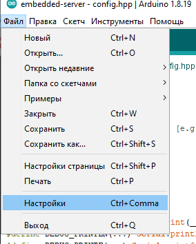
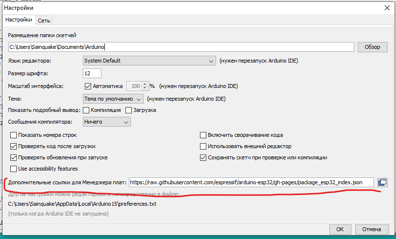
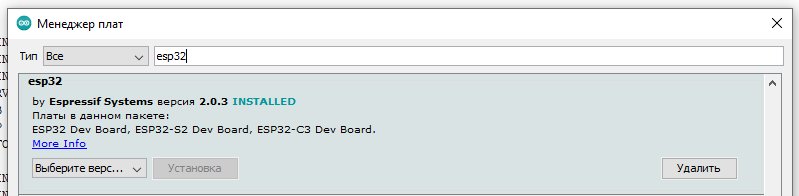
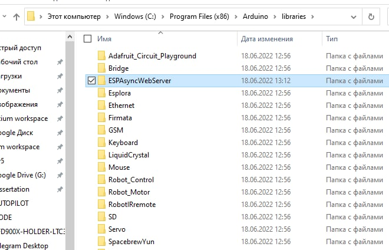
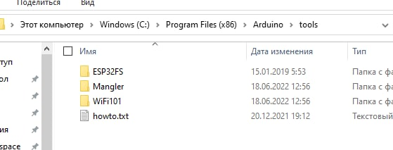
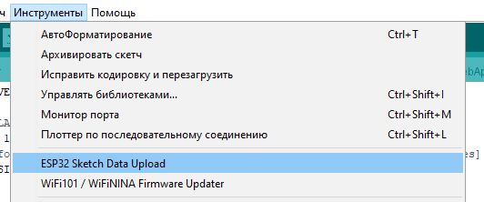
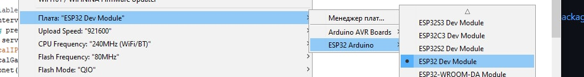
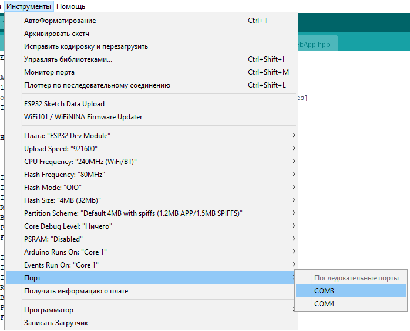
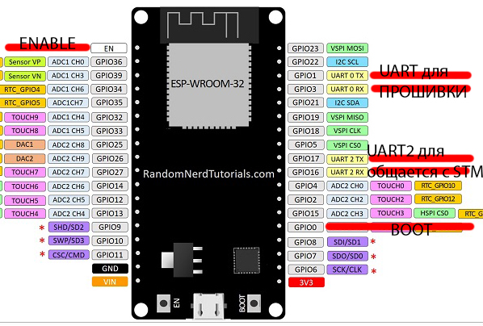

## Установка

Установи arduino IDE [https://www.arduino.cc/en/software](https://www.arduino.cc/en/software)


Добавь ссылку https://raw.githubusercontent.com/espressif/arduino-esp32/gh-pages/package_esp32_index.json в: Файл->Настройки->Дополнительные ссылки...




Зайди в инструменты - Плата:... - Менеджер Плат

В поиске вбей esp32 и установи



Положи содержимое архива в репе C:\embedded-server\lib\ESPAsyncWebServer.zip в папку библиотек ардумны C:\Program Files (x86)\Arduino\libraries folder 



Положи содежимое архива ESP32FS-1.0.zip в папку C:\Program Files (x86)\Arduino\tools



Перезипусти IDE

## Прошивка

Инструменты -> Платы:.. -> ESP32 Arduino -> ESP32 Dev Module


<!--  -->
нажать галку, если все собралось, то ок.


выбрать правильный ком порт



нажать кнопку со стрелкой


## Загрузка UI

содержимое UI находится в папке C:\embedded-server\data

чтобы залить содержимое сайта нужно зайти: Инструменты -> ESP32 Sketch Data Upload


при обновлении содержимого набор файлов не должен меняться, например файлы типа bundle.js.map нужно удалить
# PINOUT

Чтобы войти в режим программирования нужно зажать BOOT и EN, а потом отпустить сначала EN потом BOOT




# ESP32server
Labroatory WebServer based on ESP32 serving BLE and Web over network for ZARNITZA company
# Compile options

# Device Modes
## SERVER 
http://62.113.104.145/?sn=<SERIALNUMBER>
e.g: 
http://62.113.104.145/?sn=16682

## Local
http://192.168.4.1/
http://192.168.4.1/config

# Frimware Upgrade
1.  Choose your prefered version of the frimware from [here](./release).
2.  Upload the frimware using [flash download tools](./flash_download_tool_3.9.2). Make sure the compile options are preserved. You may read the documention for usage of this tool [here](./flash_download_tool_3.9.2/doc).


# Frimware Configuration
Device predefined variables are modifiable.
In [configuration file](./config.hpp), predifeined variable of the frimware may be  changed and rebuilt.
> [CAUTION] **DO NOT** change the reserved configuration.
## [File System Tools ](./lib/ESP32FS-1.0.zip) 
Extract copy the jar file into the path ```{ARDUINO_PATH}/tools/ESP32FS/tool```
> This tool is used for uploading the *root folder* into SPIFFS. In order upload into the file system, just follow this steps in ArduinoIDE [ tools > ESP32 Sketch Data Upload] 
## Configuration Details
* Serial Port For the Lab
  ```#define LAB_SERIAL Serial1
  #define LAB_BAUDRATE 115200
  ```
* Access-Point name
  ```
  #define SSID_AP "zlab" 
  #define SSID_AP_LEN 4 
  ```
* DNS RESOLVE DOMAIN e.g http://DOMAIN.local
  ```
  #define DOMAIN "zlab"
  #define DOMAIN_LEN 4
  ```
* WebApp and server endpoints
  ```
  #define PATH_SENDCOMMAND "/api/lab/send-command"
  #define PATH_SENDCOMMAND_LEN 22
  #define PATH_SUBSCRIBE "/api/lab/subscribe"
  #define PATH_SUBSCRIBE_LEN 19
  #define PATH_SOCKET "/api/lab/subscribe"
  #define PATH_CONFIG "/config"
  #define PATH_CONFIG_LEN 7
  ```
* WEBSOCKET CYCLE

  ```
  #define CYCLE_INTERVAL 230
  ```
* Laboratory [STM] Heartbeat cycle
  ```
  #define HEARBEAT_INTERVAL 2500
  ```
* UDP server Specifications
  ```
  #define UDP_SERVER_IP "10.242.1.99"
  #define UDP_SERVER_IP_LEN 11
  #define UDP_SERVER_PORT 42
  #define UDP_SERVER_AWAIT 100
  ```
* TIMEOUT FOR LAB [STM] response
  ```
  #define TIMEOUT 20
  ```
* Buffer size for binary requests [e.g send-command, socket packets, laboratory responses]
  ```
  #define BUFFER_SIZE 2048
  ```

# Dependencies for developer
## [Development Stack]
  * [Arduino IDE](https://www.arduino.cc/en/software)
  * [Espressif](https://docs.espressif.com/projects/arduino-esp32/en/latest/installing.html)
    >Installation of stable Espressif on ArduinoIDE
## [Libraries](./lib) 
Install following Libraries in your ArduinoIDE according to the guide for installing library from a ZIP.
## [File System Tools](./lib/ESP32FS-1.0.zip) 
Extract copy the jar file into the path ```{ARDUINO_PATH}/tools/ESP32FS/tool```
> This tool is used for uploading the *root folder* into SPIFFS. In order upload into the file system, just follow this steps in ArduinoIDE [ tools > ESP32 Sketch Data Upload] 

